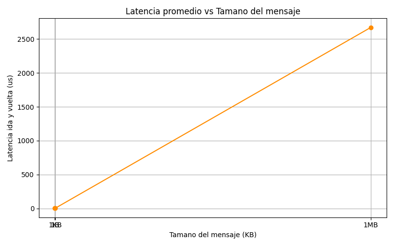

-----

# Tarea 3 - Computacion Paralela y Distribuida

**Autor:** William Adrian Carballo Flores

**Curso:** Computacion Paralela y Distribuida

**Profesor:** Johansell Villalobos Cubillo

## Objetivos

  * Aplicar operaciones colectivas de MPI (Bcast, Scatter, Reduce, Gather) para calcular estadisticas globales sobre un arreglo de datos distribuidos.
  * Medir la latencia de comunicacion punto a punto entre dos procesos con Send y Recv.
  * Analizar el impacto del tamano del mensaje en la latencia y en el ancho de banda.

-----

## Requisitos para Ejecucion

Antes de ejecutar el codigo, es necesario tener instalados los paquetes **mpi4py**, **openmpi** y **matplotlib**. La forma mas sencilla de instalar estas dependencias es a traves de conda:

```bash
conda install -c conda-forge mpi4py openmpi matplotlib
```

-----

## Como Ejecutar

A continuacion se detalla como compilar y ejecutar cada parte de la tarea.

### Parte A: Estadisticas Globales con Operaciones Colectivas

Este programa demuestra el poder de las operaciones colectivas de MPI. Genera un arreglo de gran tamano, lo distribuye entre los procesos disponibles usando `Scatter`, cada proceso calcula sus estadisticas locales y finalmente se consolidan los resultados de todos los procesos con `Reduce`.

Para ejecutarlo con **4 procesos** y un arreglo de **1,000,000 de elementos**, use el siguiente comando:

```bash
mpirun --oversubscribe -np 4 python estadisticas_mpi.py 1000000
```

### Parte B: Medicion de Latencia Punto a Punto y Grafico

Este script mide el rendimiento de la comunicacion basica en MPI. Se enfoca en la latencia de enviar y recibir mensajes entre dos procesos (`Send`/`Recv`) para distintos tamanos de datos. Al finalizar, genera un grafico que visualiza la relacion entre el tamano del mensaje y la latencia.

Para ejecutarlo con **2 procesos**, use este comando:

```bash
mpirun --oversubscribe -np 2 python latencia_mpi.py
```

El script guardara automaticamente el grafico resultante con el nombre `latencia_vs_tamano.png` en el mismo directorio.

### ¿Por que usar --oversubscribe?

El parametro `--oversubscribe` le indica a MPI que permita la ejecucion de mas procesos que el numero de nucleos fisicos disponibles en el sistema. Esto es especialmente util en entornos de desarrollo (como una laptop, VSCode o WSL) donde no se dispone de un cluster con muchos nodos. Sin esta opcion, MPI podria abortar la ejecucion si se solicitan mas procesos que "slots" de hardware detectados. Para esta tarea, que es de caracter experimental y de aprendizaje, el uso de `--oversubscribe` es apropiado y necesario para garantizar la ejecucion sin importar la configuracion del hardware local.

-----

## Resultados Obtenidos

A continuacion se presentan las salidas exactas obtenidas al ejecutar los scripts.

### Parte A - Salida de Estadisticas Globales

Se genero un arreglo con 1,000,000 de numeros aleatorios entre 0 y 100. La salida fue la siguiente:

```yaml
Arreglo original (primeros 10 valores): [92.19639908 27.36227753 50.75910855 96.65761038 13.78006045 10.27147268
 21.83517213 31.43050942 80.3323825  78.94533565]

Estadisticas globales:
  Minimo: 0.0001
  Maximo: 100.0000
  Promedio: 50.0004
```

Los resultados son consistentes con lo esperado: el minimo y el maximo estan muy cerca de los limites del rango (0 y 100), y el promedio se acerca a 50, que es la media teorica de una distribucion uniforme en ese rango.

### Parte B - Salida de Medicion de Latencia

Se midio la latencia para diferentes tamanos de mensaje.

```text
--- latencia con mensaje de 1 byte ---
Mensaje de 1 byte transmitido 10000 veces.
Latencia promedio por mensaje (ida y vuelta): 2.54 microsegundos
Latencia estimada unidireccional: 1.27 microsegundos

--- medicion con 1B, 1KB, 1MB ---
Tamano 1 bytes - Latencia promedio: 2.61 us

--- medicion con 1B, 1KB, 1MB ---
Tamano 1024 bytes - Latencia promedio: 3.22 us

--- medicion con 1B, 1KB, 1MB ---
Tamano 1048576 bytes - Latencia promedio: 2672.26 us

Grafico guardado como latencia_vs_tamano.png
```

### Grafico: Latencia vs. Tamano de Mensaje

El siguiente grafico fue generado por `latencia_mpi.py` y es clave para el analisis.

-----

## Interpretacion y Analisis de Resultados

El grafico muestra la latencia de ida y vuelta (en microsegundos) en el eje Y, contra el tamano del mensaje (en bytes, con escala logaritmica) en el eje X. El analisis de este grafico revela dos comportamientos distintos:

1.  **Comunicacion Dominada por Latencia (Mensajes Pequenos):** Para mensajes de 1 byte y 1 KB, la latencia es muy baja y casi constante (2.61 us vs 3.22 us). Esto indica que el tiempo de transmision del dato en si es insignificante. El costo principal es el **overhead** del sistema: el tiempo que tardan los procesos en iniciar la comunicacion, preparar los buffers y sincronizarse. En este regimen, enviar 1 KB es casi tan rapido como enviar 1 byte.

2.  **Comunicacion Dominada por Ancho de Banda (Mensajes Grandes):** Al enviar un mensaje de 1 MB, la latencia se dispara a mas de 2600 us. En este punto, el overhead inicial se vuelve despreciable en comparacion con el tiempo que se necesita para transferir la gran cantidad de datos (el *payload*) a traves de la red. La comunicacion se vuelve limitada por el **ancho de banda** del canal. Es decir, la velocidad maxima a la que los datos pueden ser enviados es el factor que domina el tiempo total.

Esta transicion es un fenomeno fundamental en sistemas de comunicacion y es crucial para el diseno de algoritmos paralelos eficientes.

## Analisis Final y Conclusiones

  * **Simplicidad de MPI:** La medicion de operaciones colectivas demostro que MPI facilita enormemente la distribucion y consolidacion de datos, permitiendo al programador concentrarse en la logica del problema en lugar de en los detalles de la comunicacion.

  * **Entendimiento de la Comunicacion:** El analisis de latencia punto a punto fue clave para entender el comportamiento real de la red. Revela que no todos los mensajes tienen el mismo costo y que el tamano es un factor critico.

  * **Importancia del Modelo Latencia/Ancho de Banda:** La grafica generada es una visualizacion clara de la transicion entre un regimen dominado por latencia (mensajes chicos) y uno dominado por ancho de banda (mensajes grandes).

  * **Relevancia para la Optimizacion:** Estos conocimientos son esenciales para optimizar programas paralelos. Por ejemplo, puede ser mas eficiente agrupar muchos mensajes pequenos en uno grande para reducir el impacto del overhead, o por el contrario, dividir un calculo muy grande para evitar la saturacion del ancho de banda.

-----

## Archivos Incluidos en el Repositorio

  * `estadisticas_mpi.py`: Implementacion de la parte A con operaciones colectivas MPI.
  * `latencia_mpi.py`: Implementacion de la parte B para medir latencia y generar grafico.
  * `latencia_vs_tamano.png`: Grafico generado con matplotlib mostrando latencia vs tamano de mensaje.
  * `README.md`: Documentacion y analisis (este archivo).

Este repositorio forma parte de la Tarea 3 del curso de Computacion Paralela y Distribuida, 2025.